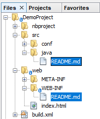

# Exemple de projet GIT avec sous projets NetBeans

Ce projet git contient dans le dossier NetBeans un projet d'application web Netbeans. Il montre :

1. comment définir le fichier `.gitignore`
2. comment faire en sorte que tous les répertoires indispensables à l'application web soient pris en compte par git, même si ils sont vides.

## 1. Le fichier `.gitignore`

Ce fichier définit les règles qui permettent d'exclure:

* les éléments construits par le compilateur:
  * repertoire `build`
  * repertoire `dist`
* les fichiers de configuration privés du projet netbeans
  * répertoire `nbproject\private`
  
## 2. Les répertoires indispensables

Pour qu'un répertoire soit enregistré dans les commits git, il ne faut pas qu'il soit vide. Aussi, pour que le squelette de projet d'application web `DemoProject` soit *'complet'*, des fichiers `README.md` ont été ajoutés aux répertoires `WEB-INF` et `src/java` afin que ceux-ci ne soient pas vides et enregistrés sur github.

  
 
